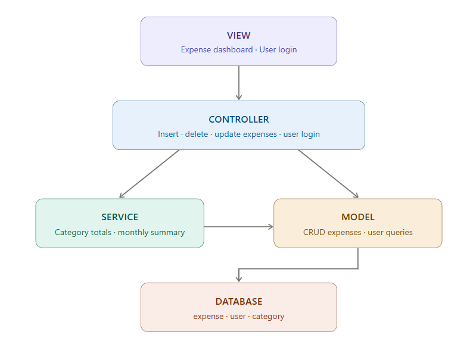
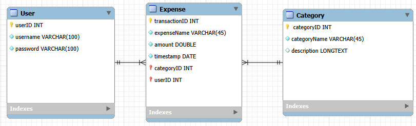
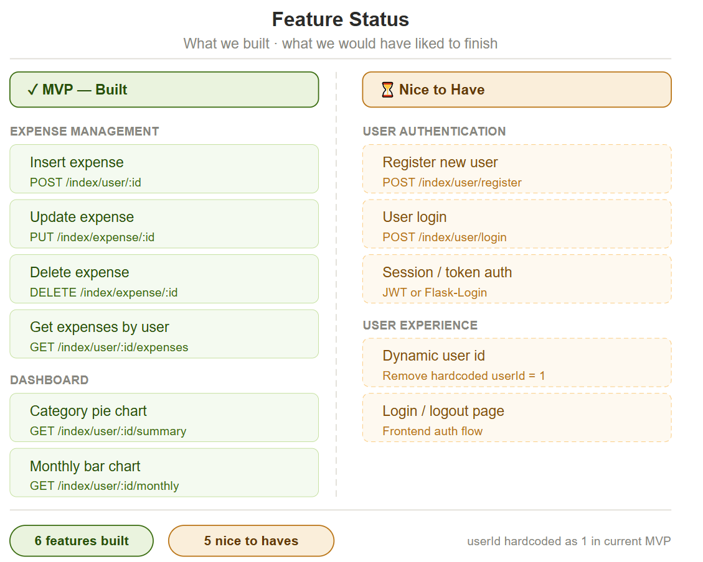
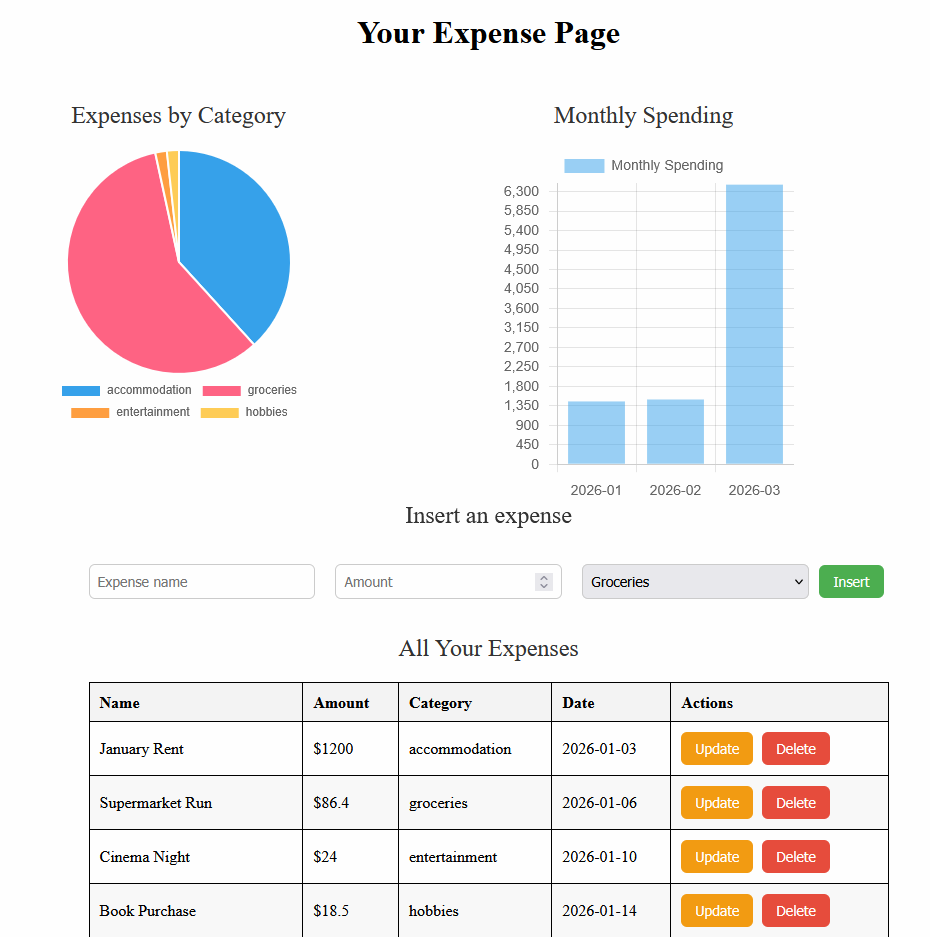
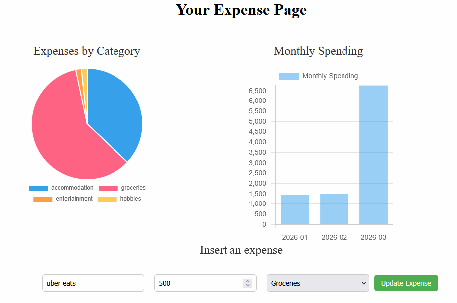

# 💰 Financial Expense Tracker

A full-stack expense tracking web app built with **Python/Flask**, **SQLite**, and vanilla **JavaScript**. Track personal expenses by category, visualize spending patterns with interactive charts, and manage your finances through a clean web interface.

---

## Features

- Add, update, and delete expenses
- Categorize expenses (Accommodation, Groceries, Entertainment, Hobbies)
- Interactive **pie chart** showing spending breakdown by category
- **Bar chart** showing monthly spending totals
- Per-user expense views
- RESTful Flask API backend
- Deployable on AWS EC2 via Docker

---

## Tech Stack

| Layer | Technology |
|---|---|
| Backend | Python 3.10, Flask, Flask-CORS |
| Database | SQLite |
| Frontend | HTML, CSS, Vanilla JavaScript |
| Charts | Chart.js |
| Deployment | Docker, AWS EC2 |

---

## Project Structure

```
financial-tracker/
├── app.py                  # Flask routes and app entry point
├── model.py                # SQLite data access layer
├── service.py              # Business logic (category summaries)
├── create_schema.py        # DB schema creation + seed data
├── insert_test_data.py     # Standalone seed script
├── query_test_data.py      # Utility script for debugging DB during development
├── requirements.txt        # Python dependencies
├── static/
│   ├── script.js           # Frontend logic and Chart.js rendering
│   └── styles.css          # App styling
├── templates/
│   └── index.html          # Main HTML page (Jinja2 template)
├── expenses_app.sh         # Deployment Docker setup script

```

---
## Project planning 

### MVC Architecture

The app follows an MVC pattern with an added service layer between the controller and model.
User interactions on the View (expense dashboard) trigger HTTP requests handled by the Controller (```app.py```), which routes them to either the Service (```service.py```) for aggregation logic, or directly to the Model (```model.py```) for CRUD operations. The model communicates exclusively with the SQLite database, which holds the expense, user, and category tables.



### Database Schema

The app uses a 3-table SQLite schema. The ```expense``` table sits at the centre, holding foreign keys to both ```user``` and ```category```. A user can have many expenses; a category can classify many expenses.

> See EER diagram below



---
### Current development status

Due to time constraints — 3 days of development and deployment on an EC2 instance — only the first MVP was fully built and functional.

#### 6 features built (MVP):

- Full CRUD expense management (insert, update, delete, get by user)
- Category spending pie chart and monthly bar chart dashboard

#### 5 nice-to-haves not yet implemented:

- User registration and login endpoints
- Session/token authentication (JWT or Flask-Login)
- Dynamic user ID (currently hardcoded as ```userId = 1```)
- Login/logout frontend flow



## API Endpoints

| Method | Endpoint | Description |
|---|---|---|
| `GET` | `/index` | Get all expenses (all users) |
| `GET` | `/index/user/<userId>` | Render the expense page for a user |
| `POST` | `/index/user/<userId>` | Add a new expense |
| `GET` | `/index/user/<userId>/expenses` | Get all expenses for a user |
| `PUT` | `/index/expense/<expenseId>` | Update an expense |
| `DELETE` | `/index/expense/<expenseId>` | Delete an expense |
| `GET` | `/index/user/<userId>/summary` | Get category spending summary |
| `GET` | `/index/user/<userId>/monthly` | Get monthly spending totals |

---

## Getting Started

### Local Setup (without Docker)

**Prerequisites:** Python 3.10+

```bash
# 1. Clone the repository
git clone <https://github.com/InahL/financial-tracker.git>
cd financial-tracker

# 2. Install dependencies
pip install -r requirements.txt

# 3. Create the database and seed with test data
python create_schema.py
python insert_test_data.py

# 4. Run the app
python app.py
```


Visit `http://localhost:5000/index/user/1` to see Alice's expense dashboard.

---

### Docker Deployment (Local)

```bash
# Build the Docker image
docker build -t expenses-backend .

# Run the container
docker run -d -p 5000:5000 --name expenses-api expenses-backend
```

---

### AWS EC2 Deployment

Use the provided deployment script to set up the app on an Amazon Linux EC2 instance:

```bash
# 1. SSH into the instance
ssh ec2-user@<your-ec2-ip>

# 2. Copy the contents of this script file:
expenses_app.sh
# into a new file on the EC2 instance
nano setup_expenses_app.sh

# 4. Paste contents and save

# 3. Run the setup script
./setup_expenses_app.sh
```

The script will:
- Make itself executable
- Install Docker on the EC2 instance
- Create the full project structure
- Build and run the Docker container on port `5000`

> **Note:** Make sure your EC2 security group allows inbound traffic on port 5000.

---

## Test Users

Two users are pre-loaded with 3 months of sample expense data (Jan–Mar 2026):

| userID | Username | Password |
|---|---|---|
| 1 | Alice | wonderland |
| 2 | Madhatter | teaparty |

Navigate to `/index/user/1` or `/index/user/2` to view each user's dashboard.

> ⚠️ In the EC2 instance the deployment is hardcoded to userId = 1. To change this to user 2 will have to change in the script and create a new docker image

> ⚠️ Passwords are stored in plain text — this project is intended for learning/demo purposes only. Do not use real credentials.

---

## Future Improvements

- User authentication with hashed passwords
- Login/logout flow
- Budget limits and alerts per category
- Export expenses to CSV
- Multi-user admin view
- Switch from SQLite to PostgreSQL for production

## Screenshots

### User view & add/delete expense


### Update expense
